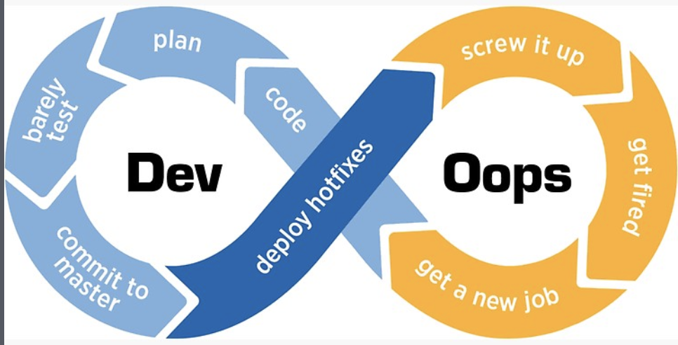

title: Into The Ansible
class: animation-fade
layout: true

<!-- This slide will serve as the base layout for all your slides -->
.bottom-bar[
  {{title}}
]

---

class: impact

# {{title}}
## Jacob Hudson - ChiPy WebDev SIG @ SpotHero - 4/3/2019

---

<center>

</center>

---

# Who am I?

### Lead Cloud Engineer - Advanced Analytics @ Discover
- 1/2019 - Now
- Mostly Ansible, with some Terraform, Python, Linux

### Software Engineer II - Site Reliability Engineering @ Grainger
- 6/2015-1/2019
- Ansible, Splunk, Python, Linux

### Network Technician @ University Housing - University of Illinois
- 8/2012-5/2015
- Networking, Linux, so on...

---

<center>

</center>

---

# Why should you care?

<center>

</center>

---


class: impact

# The Basics
## Features of Ansible and Key Terms

---

<center>

</center>

---

# What is Ansible?


.col-6[
  ### Free
  - Agentless
  - Defaults to push-based operation
  - Opensource

  ### Paid
  - Centralizaton via Tower
  - Enterprise Support
]

.col-6[
  <right>
  
  </right>
]


---

# Modes of Operations

## Adhoc

```bash
ansible all -m ping
```

## Through Playbooks
- Playbooks are series of tasks, like below
  ```
  - name: Sleep for 15 seconds
    command: sleep 15
  ```
- Playbooks are series of plays to achieve a goal
- Think of them like functions

---

# Variables (Facts)

Python
```
x = 42
phrase = "hello"
colors = ['red','green','blue']
```

Ansible
```
- name: Set several Variables
  set_fact:
    x: 42
    phrase: "hello"
    colors: ['red','green','blue']
```

---

# More Facts

```
- name: Capture output
  command: dig +short google.com
  register: output
```

---

# Conditionals

Python
```
if x == 5:
  print x
```

Ansible
```
- name: Print x if it is 5
  command: echo "{{x}}"
  when: x == 5
```

---

# Loops

Python
```
for color in colors:
  print color
```

Ansible
```
- name: list a lot of colors
  command: echo "{{item}}"
  with_items: "{{colors}}"
```
---

```
---
  - hosts: 127.0.0.1 # hosts to run on
    tasks:
    - name: Set several Variables
      set_fact:
        x: 42
        phrase: "hello"
        colors: = ['red','green','blue']

    - name: Capture output
      command: dig +short google.com
      register: output

    - name: Print x if it is 5
      command: echo "{{x}}"
      when: x == 5

    - name: list a lot of colors
      command: echo "{{item}}"
      with_items: "{{colors}}"
```

---

# Roles & Galaxy

## Roles - Entirely reusable Playbook
- Very modular
- Think of it like a class in Python
- Create scaffolding for a new role with `ansible-galaxy init <rolename>`

## Galaxy - Marketplace of prebuilt roles
- https://galaxy.ansiclbe.com


---

class: impact

# Use Cases
## Ways I have used Ansible through the years

---

# Provisioning & Configuration Management

## Provisioning
- Building infrastructure, eg AWS services
- Terraform

## Configuration Management
- Installing/upgrading/etc on a large free of machines at once
- Chef/Puppet/Salt

---

# Self Service
- Allowing a user a limited subset of actions
- Fully monitored
- Allows for UI-based interaction
- Ansible Tower
- Open Source Variants:  AWX and Semaphore

---


class: impact

# Gotchas and Pitfalls
## DevOps Engagement or DevOops Enragement?

---

# Issues with Ansible

- Python 2 (for now)
- Serial execution (slow)
- Less common modules are brittle
- General Python/YAML issues (Whitespaces)

<center>

</center>


---

# Spacing & Indentation/General Errors
```
---
  - hosts: 127.0.0.1 # hosts to run on
    tasks:
    - name: Showing indent issues
      shell: hostname
      changed_when: false
       failed_when: false # look here
      register: output

    - name: Echo hostname
      command: echo {{item}}
      with_items:
        - {{output}} # and here
```

---

# Variable Reuse
```
---
  - hosts: 127.0.0.1 # hosts to run on
    vars:
      is_one: 1
    tasks:
    - name: This is true
      command: echo foo
      when: is_true == 1

    - name: This is false
      command: echo bar
      when: is_true != 1

    - name: Write output to console
      debug:
        var: is_true.stdout
```

---

# Security
```
- name: Create a JIRA issue
  uri:
    url: https://your.jira.example.com/rest/api/2/issue/
    method: POST
    user: your_username
    password: your_pass # this will be written to ansible.log
    body: "{{ lookup('file','issue.json') }}"
    force_basic_auth: yes
    status_code: 201
    body_format: json
  no_log: true # you need this to prevent that
```

---

class: impact

# Resources
## How to get started on your Pythonic DevOps journey!

---

# Resources

Technical resources to get you started:

.col-6[
  ### Blogs
  - https://www.jeffgeerling.com/blog?page=2
  - https://www.ansible.com/blog

  ### Books
  - Ansible Up and Running
  - Ansible for DevOps
]

.col-6[
  ### Repos
  - https://github.com/jdauphant/awesome-ansible
  - https://github.com/debops/debops

  ### Tools
  - Vagrant
  - Docker
]

---

<center>

</center>
